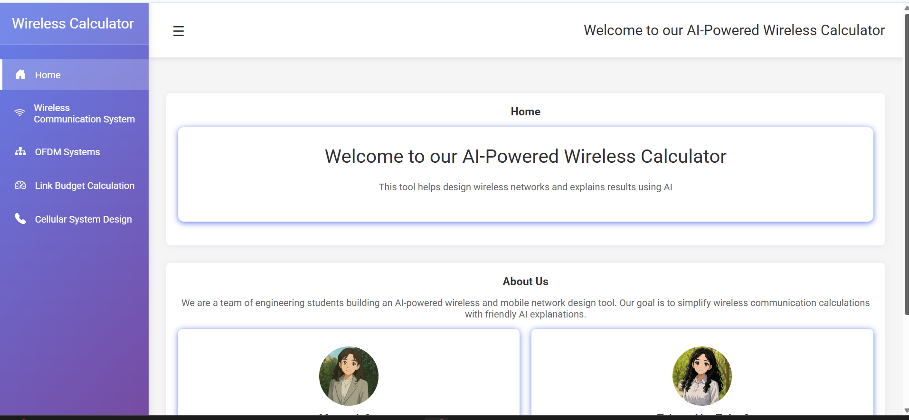

# Wireless Communication Calculator Web Application

A Flask-based web app providing interactive calculators for key wireless communication systems:

- **Communication System**: Analog bandwidth, sampling & quantization, source & channel coding, interleaving and burst formatting.  
- **OFDM System**: Compute symbol rates, resource elements, data rates, and spectral efficiency.  
- **Link Budget**: Received/transmitted power, path loss, antenna & amplifier gains, link margin.  
- **Cellular System**: Erlang B/C capacity, cell planning, frequency reuse, coverage & capacity metrics.  

Each calculator offers optional AI-powered explanations via Gemini (Google Generative AI) and Groq LLM.
You can try it out here: [Live Demo](https://wirelesswizards-taleen-mayar.onrender.com)



---

## 🔧 Prerequisites

- Python 3.10+  
- Git  
- A GitHub Personal Access Token (for cloning/private repos, if needed)  
- LLM API keys:
  - `GEMINI_API_KEY`  
  - `GROQ_API_KEY`  

---

## 🚀 Installation

1. **Clone the repo**  
   ```bash
   git clone https://github.com/your-username/Wireless-Communication-Calculator-web-application.git
   cd Wireless-Communication-Calculator-web-application
   ```

2. **Create & activate a virtual environment**  
   ```bash
   python3 -m venv venv
   source venv/bin/activate    # Linux/macOS
   venv\Scripts\activate     # Windows
   ```

3. **Install dependencies**  
   ```bash
   pip install --upgrade pip
   pip install -r requirements.txt
   ```

---

## ⚙️ Configuration

1. **Copy & edit `.env.example`**  
   Create a file named `.env` in the project root:
   ```bash
   cp .env.example .env
   ```

2. **Set your API keys**  
   ```dotenv
   # .env
   GEMINI_API_KEY=your_google_gemini_key_here
   GROQ_API_KEY=your_groq_api_key_here
   SECRET_KEY=some_random_flask_secret
   ```

   - `GEMINI_API_KEY`: Google Generative Language API key  
   - `GROQ_API_KEY`: Groq LLM service key  
   - `SECRET_KEY`: Flask session & CSRF protection key  

---

## 🏃 Running the App

```bash
# ensure your venv is active
export FLASK_APP=app.py        # Linux/macOS
set FLASK_APP=app.py           # Windows

flask run --host=0.0.0.0 --debug
```

Visit http://localhost:5000 in your browser.

---

## 📁 Project Structure

```
.
├── app.py                    # Flask routes & calculator logic
├── forms.py                  # WTForms definitions & validation
├── Gemini.py                 # Google Gemini LLM client
├── llm_agent.py              # Groq LLM client
├── requirements.txt          # Python dependencies
├── templates/                # Jinja2 HTML templates
│   ├── index.html
│   ├── communication_system.html
│   ├── ofdm_systems.html
│   ├── link_budget.html
│   └── cellular_system.html
├── static/                   # CSS, JS, images
└── Erlang B Table.csv        # Erlang B lookup table (optional)
```

---

## 🤖 AI Explanations

Each calculation page will attempt to call both Gemini and Groq APIs to generate a Markdown-formatted analysis. If either key is missing or the request fails, you’ll see a “temporarily unavailable” message instead.

---


---
## ☁️ Deployment

This Flask application is deployed on [Render](https://render.com/), a platform optimized for hosting Flask applications.  

---
## 🙏 Contributing

1. Fork this repo  
2. Create a feature branch (`git checkout -b feature/XYZ`)  
3. Commit your changes (`git commit -m "Add XYZ"`)  
4. Push to your branch (`git push origin feature/XYZ`)  
5. Open a Pull Request  

---

## 📄 License

This project is licensed under MIT. See [LICENSE](LICENSE) for details.
